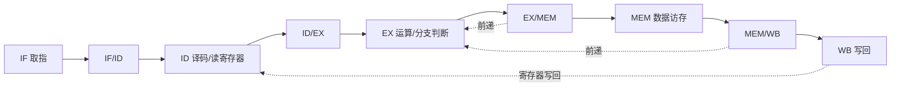

结论：你们已有 GPT 方案的大方向正确，但应当根据现有工程做三项调整：

1. 保留现有 RV32I，不换 MIPS，也不用重新设计指令集。
2. 不覆盖单周期 CPU，而是在同一工程中新建流水线 CPU，保留单周期版本作为真实对照基准。
3. 先完成“五级流水 + 前递 + load-use 停顿 + EX 阶段冲刷 + 溢出检测”，UART 暂时不要与 CPU 流水线改造捆绑。

本轮仅进行了只读分析，没有修改任何文件。

## 一、现有工程基线

任务书要求单周期 CPU 至少支持 `LW、SW、ADD、SUB、ORI、BEQ`，并运行五整数排序程序。:codex-file-citation{path="C:/Users/LiYinchen/Desktop/学习文件/计算机组成原理课程设计+汇编与接口技术课程设计/实验单周期CPU任务书.pdf" purpose="source"}

当前工程已经实现 RV32I 单周期 CPU，报告中列出了 13 条指令：

- 运算：`ADD、SUB、SLT、ADDI、ORI、SLLI、AUIPC`
- 传送：`LW、SW`
- 控制：`BEQ、BLT、BGE、JAL`

并且已有五整数冒泡排序测试。:codex-file-citation{path="C:/Users/LiYinchen/Desktop/arch-asm-project-ori-single-pipe/周泽顺-1120230501-实验二报告.pdf" purpose="source"}

现有核心实现位于：

- [SingleCycleCPU.v](C:/Users/LiYinchen/Desktop/arch-asm-project-ori-single-pipe/Lab2.srcs/sources_1/new/SingleCycleCPU.v:23)
- [ControlUnit.v](C:/Users/LiYinchen/Desktop/arch-asm-project-ori-single-pipe/Lab2.srcs/sources_1/new/ControlUnit.v:24)
- [ALU.v](C:/Users/LiYinchen/Desktop/arch-asm-project-ori-single-pipe/Lab2.srcs/sources_1/new/ALU.v:23)
- [tb_CPU.v](C:/Users/LiYinchen/Desktop/arch-asm-project-ori-single-pipe/Lab2.srcs/sim_1/new/tb_CPU.v:23)

## 二、架构选择

有三种可行路线：

- 五级流水线＋旁路：性能、报告完整度和实现难度最均衡，推荐。
- 五级流水线＋全部停顿：实现稍简单，但 CPI 较差，性能对比不漂亮。
- 三级流水线：相关处理略简单，但与教材经典结构不完全一致，报告解释和性能提升都弱一些。

建议采用经典硬布线五级流水：



分支在 EX 阶段确定，预测策略相当于“默认不跳转”。跳转时冲刷 `IF/ID` 和 `ID/EX`，代价为两个周期。

## 三、推荐的18条指令

不建议照搬原 GPT 方案重新加入 `LUI、SRL、SRA`。基于现有 13 条指令，最少增加下面 5 条即可达到 18 条：

- `AND`
- `OR`
- `XOR`
- `ANDI`
- `BNE`

最终为：

| 类型 | 指令 |
|---|---|
| R 型运算 | ADD、SUB、AND、OR、XOR、SLT |
| I 型运算 | ADDI、ANDI、ORI、SLLI |
| 数据传送 | LW、SW |
| 条件控制 | BEQ、BNE、BLT、BGE |
| 跳转/地址 | JAL、AUIPC |

这样做的优势是，现有 [ALU.v](C:/Users/LiYinchen/Desktop/arch-asm-project-ori-single-pipe/Lab2.srcs/sources_1/new/ALU.v:31) 已经写好了 AND、OR、XOR 运算，主要只需补译码逻辑，改动最小。

## 四、流水寄存器应保存的内容

### IF/ID

- `valid`
- `pc`
- `instruction`

### ID/EX

- `valid`
- `pc`、`pc + 4`
- `rs1_data`、`rs2_data`
- `imm`
- `rs1`、`rs2`、`rd`
- `uses_rs1`、`uses_rs2`
- ALU 控制、源操作数选择
- 寄存器写使能、存储器写使能、写回来源
- 分支类型、`jal` 标志

### EX/MEM

- `valid`
- ALU 结果
- 经前递处理后的 `store_data`
- `rd`
- `pc + 4`
- `reg_write`
- `mem_write`
- 写回来源

### MEM/WB

- `valid`
- ALU 结果
- 内存读取结果
- `pc + 4`
- `rd`
- `reg_write`
- 写回来源

必须设置 `valid` 位。停顿和冲刷时只需将对应流水级的 `valid` 清零，不应依赖“全零指令碰巧无副作用”。

## 五、三类相关的具体处理

### 1. 数据相关

增加 `ForwardingUnit`，为 EX 阶段两个源操作数分别产生三选一信号：

- `00`：使用 `ID/EX` 原始值
- `10`：使用 `EX/MEM` 结果
- `01`：使用 `MEM/WB` 写回值

优先级必须是 `EX/MEM` 高于 `MEM/WB`。

还要覆盖两个容易遗漏的位置：

- `sw` 的写存储器数据也要前递。
- 分支比较必须使用前递后的操作数。

`LW` 的数据在 MEM 后才产生，因此下面情况仍需停顿一个周期：

```asm
lw  x1, 0(x2)
add x3, x1, x4
```

检测条件应当是：

```text
ID/EX 是 LW
且 rd != x0
且 rd 与 IF/ID 指令实际使用的 rs1 或 rs2 相同
```

发生停顿时：

- PC 保持
- IF/ID 保持
- ID/EX 插入 bubble
- 后面的 EX/MEM、MEM/WB 正常推进

此外建议增加 WB→ID 同周期旁路。否则寄存器在时钟沿写入时，ID/EX 可能仍锁存旧的寄存器值。

### 2. 控制相关

`BEQ、BNE、BLT、BGE、JAL` 均在 EX 阶段确定结果。

跳转成立时：

- PC 写入 `ID/EX.pc + ID/EX.imm`
- 清空 IF/ID
- 清空 ID/EX
- 已经进入 EX/MEM 的老指令继续完成

控制优先级：

```text
reset > EX分支/跳转冲刷 > load-use停顿 > 正常推进
```

### 3. 结构相关

现有工程已经分离了指令存储器和数据存储器，属于 Harvard 式结构：

- IF 使用 `InstructionMemory`
- MEM 使用 `DataMemory`

因此取指和数据访存不会争用同一存储器。寄存器堆采用双读单写端口，也不存在读端口冲突。

## 六、控制器需要重构

当前 [ControlUnit.v](C:/Users/LiYinchen/Desktop/arch-asm-project-ori-single-pipe/Lab2.srcs/sources_1/new/ControlUnit.v:24) 同时承担译码和分支判定，并直接输入 `alu_zero`。这只适合单周期结构。

流水线版应拆成：

- ID 阶段的 `PipelineControlUnit`：只根据指令产生控制信号。
- EX 阶段的分支判断逻辑：根据流水后的分支类型和前递后的操作数计算 `branch_taken`。

推荐把写回选择改成两位 `wb_sel`：

```text
00 = ALU结果
01 = 内存数据
10 = PC+4（JAL）
```

比继续使用 `mem_to_reg + is_jal` 两个独立信号更不容易接错。

## 七、建议的文件改造

不要直接把 `SingleCycleCPU.v` 改没。建议保留基线并新增：

| 文件 | 处理 |
|---|---|
| `SingleCycleCPU.v` | 保持原样，用于性能基准 |
| `PipelineCPU.v` | 新建五级流水线顶层 |
| `PipelineControlUnit.v` | 新建纯译码控制器 |
| `ForwardingUnit.v` | 新建旁路控制 |
| `HazardDetectionUnit.v` | 新建 load-use 检测 |
| `PipelineALU.v` | 可新建，加入完整18指令和溢出检测 |
| `PC.v` | 复用现有 `en`，停顿时关闭 |
| `RegisterFile.v` | 基本复用，顶层增加 WB→ID 旁路 |
| `ImmediateGenerator.v` | 可直接复用 |
| `InstructionMemory.v` | 复用 |
| `DataMemory.v` | 复用 |
| `tb_PipelineCPU.v` | 新建自检式系统测试 |
| `tb_Hazard.v` | 专门验证旁路、停顿、冲刷 |

四组流水寄存器可以直接写成 `PipelineCPU.v` 中四个命名清晰的时序块。当前规模不必为了形式额外创建四个通用寄存器模块。

## 八、溢出检测

建议只对有符号的 `ADD、ADDI、SUB` 检测溢出：

```text
ADD：两个操作数符号相同，结果符号不同
SUB：两个操作数符号不同，结果符号与第一个操作数不同
```

产生 `overflow_ex`，并至少保留到 `EX/MEM`，方便波形观察。报告中要明确：它是溢出状态检测，不改变执行流程，也不触发异常。

不要把地址计算、`AUIPC` 或无符号逻辑运算误报为算术溢出。

## 九、验证方案

现有 `tb_CPU.v` 主要使用 `$monitor`，没有自动判断结果，也没有 `$finish`。流水线测试应改为自检式测试，但可保留旧 testbench 作为历史资料。

建议分六组：

1. 18条指令逐条测试。
2. ALU→ALU 前递、间隔一条指令的 MEM/WB 前递。
3. `lw-use`、`lw→branch`、`lw→sw` 停顿。
4. `add→sw` 写数据前递。
5. 分支跳转成立/不成立、JAL、错误路径不能写寄存器或内存。
6. 原五整数排序程序，和 RARS、单周期 CPU 比较最终寄存器及内存。

测试时应重点观察：

```text
PC、各级valid、各级PC、stall、flush、forwardA、forwardB、
branch_taken、WB写地址/数据、内存写地址/数据
```

## 十、性能测试

推荐同时报告 CPI 和 CPU 时间；仅比较 CPI 会得出误导性结论，因为单周期 CPU 的 CPI 固定接近 1，但时钟周期很长。

流水线 CPU 内部或 testbench 中记录：

- `cycle_count`
- `retired_count`：`MEM/WB.valid` 时增加
- `stall_count`
- `taken_branch_count`
- 可选 `overflow_count`

计算：

```text
CPI = cycle_count / retired_count
IPC = retired_count / cycle_count
CPU Time = cycle_count × 最小时钟周期
Speedup = 单周期CPU时间 / 流水线CPU时间
```

对比必须满足：

- 两个 CPU 使用同一段机器码和相同初始数据。
- 使用同一个 Vivado 版本、FPGA 器件和时序约束。
- 时钟周期来自综合/实现后的时序报告，不能直接采用 testbench 中随意设置的 10 ns。
- 至少测试五整数排序，再增加一个数据相关密集程序和一个分支密集程序。
- 报告真实的动态指令数、停顿数和分支冲刷数。

## 最终推荐范围

第一版只完成：

```text
18条RV32I指令
+ 五级硬布线流水
+ EX/MEM、MEM/WB前递
+ load-use单周期停顿
+ EX阶段分支判断与两级冲刷
+ Harvard存储结构
+ ADD/SUB/ADDI溢出检测
+ CPI与CPU时间对比
```

UART 不属于你给出的流水线 CPU 强制要求，而且会引入波特率、握手和存储器映射等另一套验证工作。除非“汇编与接口技术课程设计”明确要求外设，建议等基础流水线全部测试通过后再作为独立扩展加入。你们现有的 [周组gpt方案.md](D:/Wechat%20Document/xwechat_files/wxid_mqao8nwc1v4d32_bc36/temp/RWTemp/2026-08/05f519b2a23b82e466bf571099ec47c5/周组gpt方案.md) 可保留其总体思路，但应按上述指令集和模块划分修订。